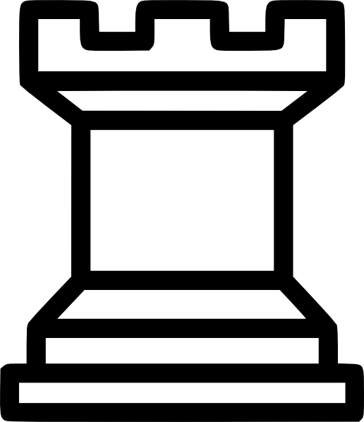
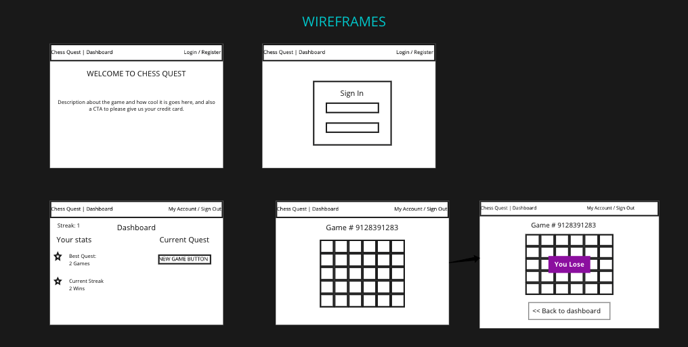

<!-- PROJECT SHIELDS -->
[![Contributors][contributors-shield]][contributors-url]
[![Forks][forks-shield]][forks-url]
[![Stargazers][stars-shield]][stars-url]
[![Issues][issues-shield]][issues-url]

<!-- PROJECT LOGO -->
 

  

  <h3 align="center">CHESS QUEST</h3>

  

    Thunderdome meets Hearthstone Arena meets Chess...it's CHESS QUEST! Online chess, except you play your next game with just the pieces you last won with. How far will your quest take you?
     
     
    <a href="https://github.com/othneildrew/Best-README-Template">View Demo</a>
    ·
    <a href="https://github.com/othneildrew/Best-README-Template/issues">Report Bug</a>
    ·
    <a href="https://github.com/othneildrew/Best-README-Template/issues">Request Feature</a>
  

<!-- TABLE OF CONTENTS -->

  
Table of Contents

  <ol>
    <li>
      <a href="#about-the-project">About The Project</a>
      <ul>
        <li><a href="#user-interface">User Interface</a></li>
        <li><a href="#built-with">Built With</a></li>
      </ul>
    </li>
    <li>
      <a href="#getting-started">Getting Started</a>
      <ul>
        <li><a href="#prerequisites">Prerequisites</a></li>
        <li><a href="#installation">Installation</a></li>
      </ul>
    </li>
    <li><a href="#usage">Usage</a></li>
    <li><a href="#roadmap">Roadmap</a></li>
    <li><a href="#contributing">Contributing</a></li>
    <li><a href="#license">License</a></li>
    <li><a href="#contact">Contact</a></li>
    <li><a href="#acknowledgements">Acknowledgements</a></li>
  </ol>

<!-- ABOUT THE PROJECT -->
## About The Project

<!-- [![Product Name Screen Shot][product-screenshot]](https://example.com) -->

Welcome to Chess Quest! This repository contains our frontend Rails app. This app makes calls to the [backend Rails API](https://github.com/chessquest/chess-quest), which makes use of a [Sinatra microservice](https://github.com/chessquest/chess-api) to retrieve data from the Chess.com API.

This project is deployed on [Heroku here](https://chess-quest.herokuapp.com)

### Built With

* [Ruby on Rails](https://rubyonrails.org/)
* [Sinatra](http://sinatrarb.com/)
* [PostgreSQL](https://www.postgresql.org/)
* [Bootstrap](https://getbootstrap.com/)
* [JQuery](https://jquery.com/)
* [RSpec](https://github.com/rspec/rspec-rails)
* [Travis CI](https://travis-ci.com/)
* [JavaScript](https://www.javascript.com)
* [OAuth](https://oauth.net/) - *Google OAuth was chosen for the Chess Quest MVP as a means to keep the barriers to entry low (google is quite common)*

<!-- CONTRIBUTORS -->
## Contributors

Adam Etzion [GitHub](https://github.com/aetzion1) [LinkedIn](https://www.linkedin.com/in/adametzion/)
Ely Hess [GitHub](https://github.com/elyhess) [LinkedIn](https://www.linkedin.com/in/ely-hess/)
Grayson Myers [GitHub](https://github.com/graymyers) [LinkedIn](https://www.linkedin.com/in/grayson-myers-285926165/)
Liam Cusack [GitHub](https://github.com/liamcusack) [LinkedIn](https://www.linkedin.com/in/liam-cusack-6a9a0a169/)
Max Ribbans [GitHub](https://github.com/ribbansmax) [LinkedIn](https://www.linkedin.com/in/max-ribbans-46b276156/)
Mike Foy [GitHub](https://github.com/foymikek) [LinkedIn](https://www.linkedin.com/in/michael-foy-707ba7b4/)
Phil McCarthy [GitHub](https://github.com/philmccarthy) [LinkedIn](https://www.linkedin/in/pjmcc)

<!-- SYSTEM DESIGN -->
## System Design

###### Basic Web Architecture 

###### Initial Wireframes

<!-- GETTING STARTED -->
### Versions

- Ruby 2.5.3

- Rails 5.2.4.3

<!-- CONTRIBUTING -->

### Contributing

Contributions are what make the open source community such an amazing place to be learn, inspire, and create. Any contributions you make are **greatly appreciated**. We hope that users provide input to improve their experience and that of others.

###### Getting Started
1. Fork the Project
2. If you don't have yarn installed locally, you can use Homebrew:
`brew install yarn`
3. Run `yarn` to install the chessboard.js and chess.js libraries.
4. Set up the rails database `rails db:{create,migrate}
5. Run `rake assets:precompile` to compile the chess-related assets 
    * *This allows these assets to be compiled and cached up front rather than compiled every time the app boots*
###### Making a Contribution
1. Create your Feature Branch (`git checkout -b feature/AmazingFeature`)
2. Commit your Changes (`git commit -m 'Add some AmazingFeature'`)
3. Push to the Branch (`git push origin feature/AmazingFeature`)
4. Open a Pull Request

The Chess.js and Chessboard.js documentation can be referenced for additional [chessboard methods](https://github.com/jhlywa/chess.js/) and [examples of implementation](https://chessboardjs.com/docs), respectively

<!-- ROADMAP -->
## Roadmap

The team utilized a [github project board](https://github.com/orgs/chessquest/projects/1) to organize project issues and cooridnate workflow across 7 members and 3 repositories.

See the [open issues](https://github.com/othneildrew/Best-README-Template/issues) for a list of proposed features (and known issues).

## User Interface

This application allows a visitor to play a practice chess game or log-in via Google OAuth to start a quest.

After authenticating, we allow users to:
* Naviagte to the user Dashboard to:
  * View their curent and complete quests
  * View their current and past games
  * View relevant user stats
* Start a quest via the dashboard if there is not one ongoing

* Start a game via the dashboard if there is not one ongoing
  * For a quest's first game, users can select (via a dropdown) to start with all their pieces, in "classic mode" or to start using a board from a selection of famous chess players

* Within the Gameplay page, users are able to play a game to completion
  * The Chess Quest MVP allows for PvC only

<!-- LICENSE -->
## License

Distributed under the MIT License. See `LICENSE` for more information.

<!-- CONTACT -->
## Contact

Project Link: [https://github.com/chessquest/chess-quest-web](https://github.com/chessquest/chess-quest-web)

See the [open issues](https://github.com/chessquest/chess-quest-web/issues) for a list of proposed features (and known issues).

<!-- ACKNOWLEDGEMENTS -->
## Acknowledgements
* [chessboard.js](https://chessboardjs.com/)
* [chess.js](https://github.com/jhlywa/chess.js)
* [Img Shields](https://shields.io)
* [Font Awesome](https://fontawesome.com)
* [MIT Open Source License](https://opensource.org/licenses/MIT)

<!-- MARKDOWN LINKS & IMAGES -->
<!-- https://www.markdownguide.org/basic-syntax/#reference-style-links -->
[contributors-shield]: https://img.shields.io/github/contributors/chessquest/chess-quest-web.svg?style=for-the-badge
[contributors-url]: https://github.com/chessquest/chess-quest-web/graphs/contributors
[forks-shield]: https://img.shields.io/github/forks/chessquest/chess-quest-web.svg?style=for-the-badge
[forks-url]: https://github.com/chessquest/chess-quest/network/members
[stars-shield]: https://img.shields.io/github/stars/chessquest/chess-quest-web.svg?style=for-the-badge
[stars-url]: https://github.com/chessquest/chess-quest-web/stargazers
[issues-shield]: https://img.shields.io/github/issues/chessquest/chess-quest-web.svg?style=for-the-badge
[issues-url]: https://github.com/chessquest/chess-quest-web/issues

<!-- [product-screenshot]: images/screenshot.png -->
[product-screenshot]: images/screenshot.png
